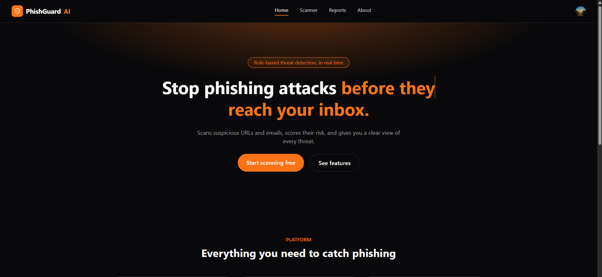
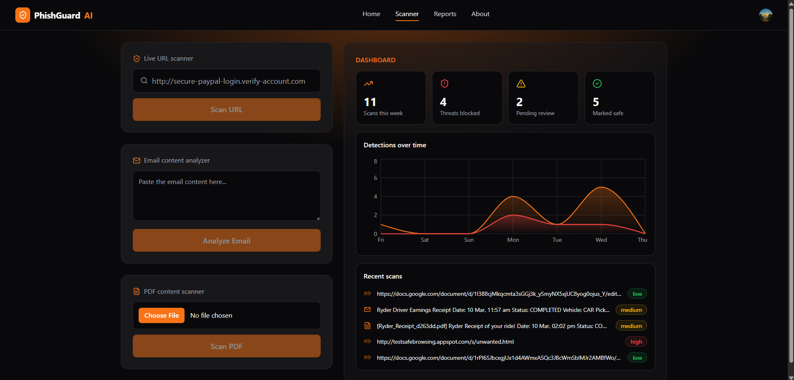
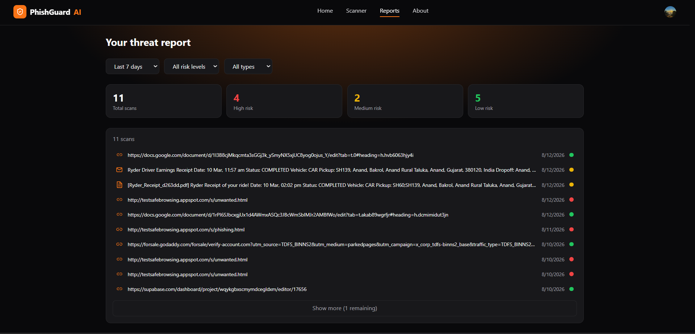
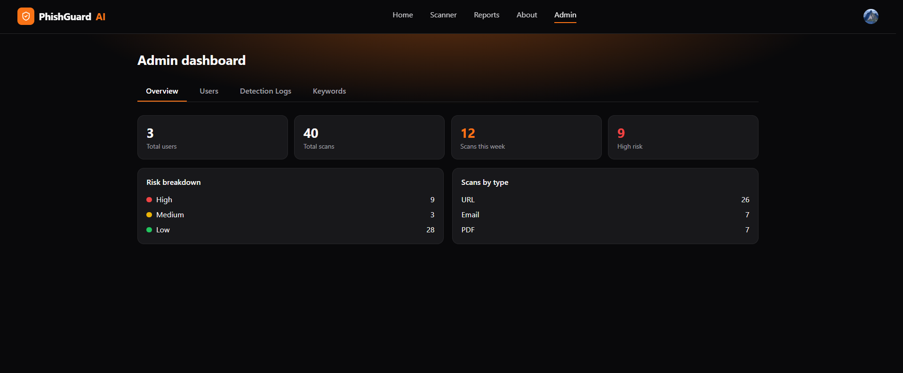
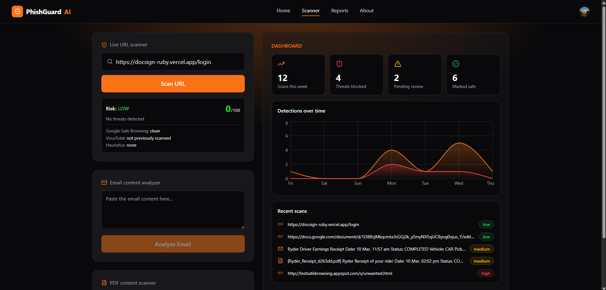
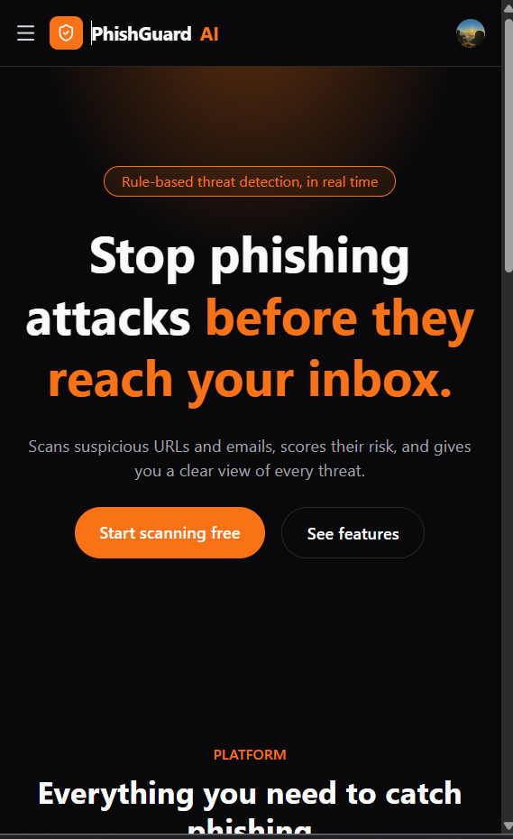

# 🛡️ PhishGuard AI

A rule-based phishing detection platform that scans URLs, email content, and PDF attachments for signs of phishing — and gives you a clear, scored view of the threat.


---

## ✨ Features

### User features
- 🔗 **URL Scanner** — checks a URL against Google Safe Browsing, VirusTotal, and local heuristics (HTTPS, IP-based domains, URL shorteners, suspicious keywords in the domain). Returns a risk level (Low/Medium/High) and a color-graded **0–100 risk score**.
- 📧 **Email Analyzer** — paste raw email content and it's scored against a configurable phishing-phrase list.
- 📄 **PDF Analyzer** — upload a PDF; text is extracted and scored using the same keyword engine as the email analyzer.
- 📊 **Dashboard** — live stats (scans this week, threats blocked, pending review, marked safe), a 7-day detections chart, and a recent-scans feed.
- 📋 **Reports** — full scan history with filters (date range, risk level, scan type) and a detail view for every past scan, including the full detection breakdown.
- 🔐 **Authentication** — sign-up/sign-in handled by Clerk.
- 📱 **Responsive** — mobile-friendly with a slide-out navigation menu.

### Admin features
- 👥 **User Management** — view all registered users, their scan counts, and high-risk scan counts.
- 📜 **Detection Logs** — every scan across every user, searchable and filterable.
- 📈 **Analytics** — platform-wide totals, risk breakdown, and scans-by-type.
- 🔑 **Keyword Management** — add/remove the phrases that power email and PDF phishing detection.
- Access is restricted to a single pre-approved account, checked directly against the signed-in Clerk email on every request.

---

## 📸 Screenshots

<table>
  <tr>
    <td align="center">
      
      <br/><sub>Home page</sub>
    </td>
    <td align="center">
      
      <br/><sub>Scanner + Dashboard</sub>
    </td>
  </tr>
  <tr>
    <td align="center">
      
      <br/><sub>Reports</sub>
    </td>
    <td align="center">
      
      <br/><sub>Admin dashboard</sub>
    </td>
  </tr>
  <tr>
    <td align="center">
      
      <br/><sub>URL scan result with risk score</sub>
    </td>
    <td align="center">
      
      <br/><sub>Mobile navigation</sub>
    </td>
  </tr>
</table>

---

## 🧰 Tech Stack

**Frontend**
- [Next.js 16](https://nextjs.org/) (App Router, Turbopack)
- React + TypeScript
- Tailwind CSS
- [Clerk](https://clerk.com/) — authentication
- [Recharts](https://recharts.org/) — dashboard charts
- [Lucide React](https://lucide.dev/) — icons

**Backend**
- Node.js + Express
- [Clerk (Express SDK)](https://clerk.com/docs) — auth verification
- [Supabase](https://supabase.com/) (PostgreSQL) — database
- [Multer](https://github.com/expressjs/multer) + [pdf-parse](https://www.npmjs.com/package/pdf-parse) — PDF upload & text extraction
- Helmet + express-rate-limit — security headers & rate limiting

**External APIs**
- [Google Safe Browsing API](https://developers.google.com/safe-browsing) — URL reputation
- [VirusTotal API](https://developers.virustotal.com/) — multi-vendor URL scanning

**Deployment**
- Frontend → [Vercel](https://vercel.com/)
- Backend → [Render](https://render.com/)

---

## 🧠 How Detection Works

### URL Scanner
1. Checks a 24-hour cache first to avoid re-hitting external APIs for the same URL.
2. Queries **Google Safe Browsing** — a match is an automatic **High** risk result.
3. Queries **VirusTotal** — counts of vendors flagging the URL as malicious/suspicious feed into the score.
4. Runs local heuristics — missing HTTPS, IP-address domains, known URL shorteners, excessive subdomains, suspicious words in the domain (e.g. "secure", "verify", "login").
5. Combines all three signals into a risk level **and** a 0–100 score:
   - **0–29** → Low (green)
   - **30–70** → Medium (yellow)
   - **71–100** → High (red)

### Email & PDF Analyzer
- Content is matched (case-insensitive, whitespace-normalized) against a phrase list stored in the database.
- Each matched phrase has a configurable weight; the total score determines Low/Medium/High.
- Admins manage this phrase list from the Admin → Keywords tab — no code changes needed to tune detection.

---

## 📁 Project Structure

```
phishing-detector/
├── backend/
│   ├── config/
│   │   └── admin.js              # Admin email allowlist
│   ├── middleware/
│   │   └── requireAdmin.js       # Admin route guard
│   ├── services/
│   │   ├── safeBrowsing.js       # Google Safe Browsing integration
│   │   ├── virusTotal.js         # VirusTotal integration
│   │   ├── riskScore.js          # URL risk scoring
│   │   ├── urlHeuristics.js      # Local URL red-flag checks
│   │   ├── emailAnalyzer.js      # Keyword-based scoring
│   │   ├── pdfExtractor.js       # PDF text extraction
│   │   ├── users.js              # User lookup / creation
│   │   ├── stats.js              # Dashboard stats
│   │   ├── chart.js              # 7-day detections chart data
│   │   ├── reports.js            # Report filtering queries
│   │   ├── keywords.js           # Keyword CRUD
│   │   ├── adminData.js          # Admin panel queries
│   │   └── cache.js              # URL scan cache
│   ├── db.js                     # Supabase client
│   └── server.js                 # Express app & routes
├── frontend/
│   ├── app/
│   │   ├── page.tsx              # Home
│   │   ├── scanner/page.tsx      # Scanner + Dashboard
│   │   ├── reports/page.tsx      # Reports
│   │   ├── admin/page.tsx        # Admin panel
│   │   ├── about/page.tsx        # About / Security / Privacy / Contact
│   │   ├── components/
│   │   │   ├── Navbar.tsx
│   │   │   └── Footer.tsx
│   │   └── layout.tsx
│   └── lib/
│       └── api.ts                # API base URL config
└── README.md
```

---

## 🚀 Getting Started

### Prerequisites
- Node.js 20+
- A [Supabase](https://supabase.com/) project
- A [Clerk](https://clerk.com/) application
- API keys for [Google Safe Browsing](https://console.cloud.google.com/) and [VirusTotal](https://www.virustotal.com/)

### 1. Clone the repo
```bash
git clone https://github.com/SaharshPatel2112/phishing-detector.git
cd phishing-detector
```

### 2. Backend setup
```bash
cd backend
npm install
```
Create `backend/.env` — see [Environment Variables](#-environment-variables).


```bash
node server.js
```
Backend runs on `http://localhost:5000`.

### 3. Frontend setup
```bash
cd ../frontend
npm install
```
Create `frontend/.env.local` — see [Environment Variables](#-environment-variables).

```bash
npm run dev
```
Frontend runs on `http://localhost:3000`.

---

## 🔑 Environment Variables

**`backend/.env`**
```env
PORT=5000
CLERK_SECRET_KEY=
SUPABASE_URL=
SUPABASE_SERVICE_ROLE_KEY=
GOOGLE_SAFE_BROWSING_API_KEY=
VIRUSTOTAL_API_KEY=
FRONTEND_URL=http://localhost:3000
```

**`frontend/.env.local`**
```env
NEXT_PUBLIC_CLERK_PUBLISHABLE_KEY=
CLERK_SECRET_KEY=
NEXT_PUBLIC_API_URL=http://localhost:5000
```

> ⚠️ Never commit `.env` or `.env.local` — both are already in `.gitignore`.

---

## 🗄️ Database Setup

Run in the Supabase SQL Editor:

```sql
create table users (
  id uuid primary key default gen_random_uuid(),
  clerk_user_id text unique not null,
  name text,
  email text not null,
  role text not null default 'user' check (role in ('user','admin')),
  created_at timestamptz default now()
);

create table scan_history (
  id uuid primary key default gen_random_uuid(),
  user_id uuid references users(id) on delete cascade,
  scan_type text not null check (scan_type in ('url','email','pdf')),
  content text not null,
  result jsonb not null,
  risk_level text not null check (risk_level in ('low','medium','high')),
  created_at timestamptz default now()
);
create index idx_scan_history_user on scan_history(user_id);
create index idx_scan_history_created on scan_history(created_at);

create table suspicious_keywords (
  id uuid primary key default gen_random_uuid(),
  phrase text not null,
  weight int not null default 1,
  created_at timestamptz default now()
);
```

Admin access is granted by matching your Clerk email against an allowlist in `backend/config/admin.js` — update that file with your own email before running locally.

---

## 📡 API Reference

| Method | Endpoint | Auth | Description |
|---|---|---|---|
| POST | `/api/scan/url` | User | Scan a URL |
| POST | `/api/scan/email` | User | Analyze email content |
| POST | `/api/scan/pdf` | User | Upload & scan a PDF |
| GET | `/api/dashboard/stats` | User | Weekly stat counters |
| GET | `/api/dashboard/recent` | User | Recent scans feed |
| GET | `/api/dashboard/chart` | User | 7-day detections chart data |
| GET | `/api/reports` | User | Filtered scan history |
| GET | `/api/admin/keywords` | Admin | List keywords |
| POST | `/api/admin/keywords` | Admin | Add a keyword |
| DELETE | `/api/admin/keywords/:id` | Admin | Remove a keyword |
| GET | `/api/admin/users` | Admin | All users + scan counts |
| GET | `/api/admin/logs` | Admin | All scans, all users |
| GET | `/api/admin/analytics` | Admin | Platform-wide analytics |

All routes require a Clerk session token in the `Authorization: Bearer <token>` header.

---

## ☁️ Deployment

**Backend (Render)**
1. New Web Service → connect this repo → Root Directory: `backend`
2. Build: `npm install` · Start: `node server.js`
3. Add all backend env vars (see above), with `FRONTEND_URL` set to your Vercel URL

**Frontend (Vercel)**
1. New Project → connect this repo → Root Directory: `frontend`
2. Add all frontend env vars, with `NEXT_PUBLIC_API_URL` set to your Render URL


---

## 🔒 Security Notes

- **Rate limiting** — scan endpoints are capped per client to protect the free-tier quota on VirusTotal (500 requests/day) and prevent abuse.
- **URL scan caching** — identical URLs scanned within 24 hours reuse the cached result instead of re-querying external APIs.
- **Admin access** — verified against the signed-in Clerk email on every request, not a client-trusted flag.
- **Security headers** — set via Helmet.
- **CORS** — restricted to the deployed frontend origin only.
- **Input validation** — URL format, content length, and file type are validated server-side before processing.

---

## 🛣️ Known Limitations / Roadmap

- No trained ML model — detection is rule-based (by design, see top of this README).
- User management is currently view-only (no disable/suspend action).
- No live scanning for brand-new, never-before-seen URLs (VirusTotal submit + poll flow) — currently only checks existing threat-intel records.
- Scanned image PDFs (no extractable text layer) aren't supported.
- Runs on Clerk development keys — production traffic would need a verified Clerk production instance.
